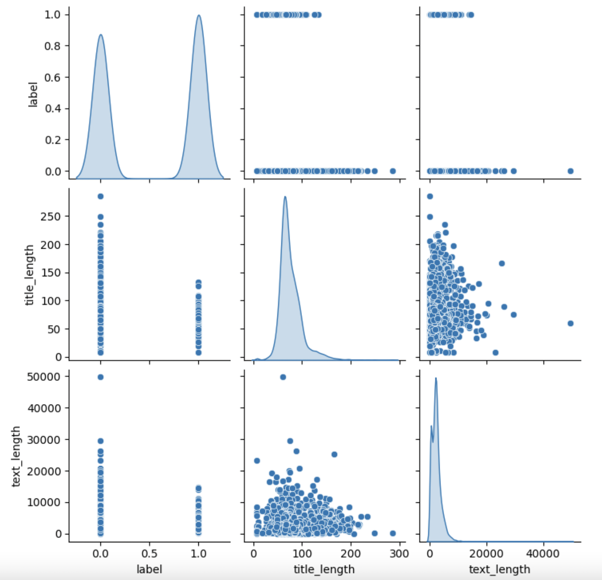
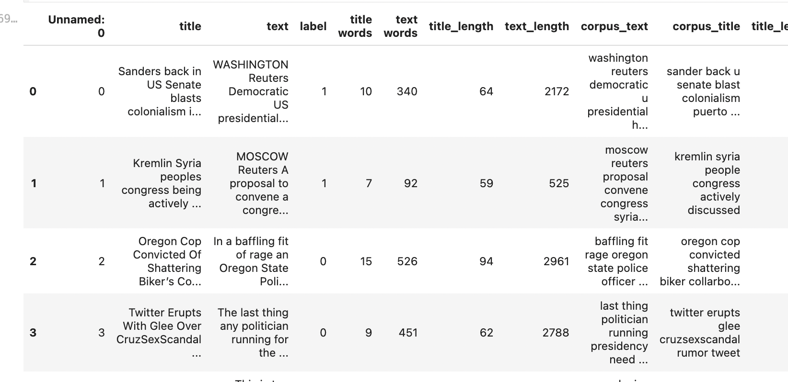
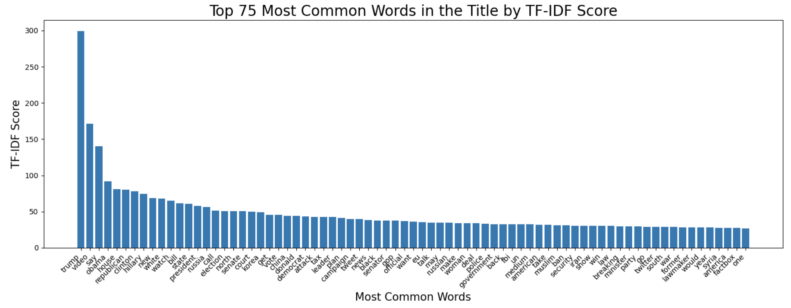
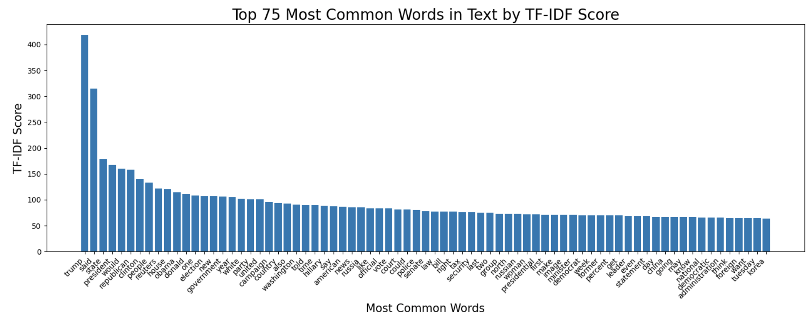

## Methods

### Initial Data Exploration & Preprocessing 

Once we got hold of our dataset, the first thing we analyzed was the overall data. Initially, we dealt with an 8117x4 dataset, which while there were many observations, we only had a few features to work with (that being an id column which was negligible, a column for titles, a column for article text, and a label which indicated if the article was real (0) or fake (1)). As such, we decided on doing a deeper dive to see how exactly our text data was like, grabbing more metadata rather than just accepting the text entries as is. Below are our findings/methodology for this initial data exploration:
   - We surprisingly had no null/blank entries
   - We were working with more entries that were fake than real
   - We checked word counts on our text (min: 1.000000, average: 407.745596, median: 368.000000, max: 7304.000000) and title columns (min: 1.000000, average: 12.093754, median: 11.000000, max: 45.000000)

Given we only had a few features to work with, we generated new features of text and title word length by splitting both features by the ' ' character and getting its length. We created a pair-plot to see if these features had any impact on the output label:

We then used a natural language tokenizer (NLTK) to generate word tokens after processing each word to prevent duplicate/meaningless tokens (removing capitalization, plurals, stop words, etc). After creating these tokens, we generated new text and title features that contained these "cleaned tokens" in replacement of these original tokens, all separated by space (called "corpus_text/title"): 

We also engineered a "lexical diversity" feature, which spits out the number of unique tokens in each title and text. This was done by simply creating a set of each list of tokens per observations (which automatically removes duplicates), and taking the length.

After preprocessing, we moved to building our models using our preprocessed dataset. Initially, we tried a more general Bag of Words-style Logistic Regression to see how well we could classify our data. Later on for our subsequent milestone, we tested how our model performed on an XGBoost model. Below are the specifications for our models:

### Model 1 (Bag of Words Logistic Regression)
1. **Preprocessing for Model**  
   - Applied CountVectorizer on the text data on each observation, which counts each word within the dataset vocabulary and creates a vector for the counts of each possible word. This is a bag of words vector.

2. **Model**
   - Logistic Regression model on this bag of words vector
   - Tuned C parameter

3. **Evaluation Metrics**  
   - Used classification metrics such as accuracy, precision, recall, and F1-score to evaluate model performance on training and testing datasets.
   - Computed True Positive, True Negative, False Positive, False Negative values
   - Created Error Complexity Graph to evaluate different values of regularization parameter C

### Model 2 (XGBoost)
1. **Preprocessing for Model**  
   - Cleaned and transformed text data into features like lexical diversity, average word lengths, sentence counts, and more.
   - Dropped unnecessary columns and separated data into features (X) and labels (y).

2. **Model**
   - XGBoost Classifier on feature engineered numerical data
   - Tuned parameters such as `n_estimators`, `learning_rate`, and `max_depth`, `lambda`, and `alpha`
   - Used Graph Search in order to optimize these parameters

3. **Evaluation Metrics**  
   - Used classification metrics such as accuracy, precision, recall, and F1-score to evaluate model performance on training and testing datasets.
   - Computed True Positive, True Negative, False Positive, False Negative values
   - Created Error Complexity Graph to evaluate different values of regularization parameter alpha

### Additional Observation Steps
We also measured our TF-IDF scores on both the title and text entries. This was to mainly help us figure out what specific words/phrases may contribute to classifying our observations. Below are the findings:

Title:

Text:

***

## Results
#### Model 1:
For Model 1 (Bag of Words Logistic Regression), our resulting metrics on the training set were the following: 
   - Precision: 1.00
   - Recall: 1.00
   - F1 Score: 1.00
   - Accuracy: 1.00

For our test set using the same model, our results were:
   - Precision: 0.97
   - Recall: 0.98
   - F1 Score: 0.97
   - Accuracy: 0.97

Error Complexity Graph:

     
#### Model 2:
For Model 2 (XGBoost), our resulting metrics on the training set were the following: 
   - Precision: 0.97 (Class 0); 0.95 (Class 1)
   - Recall: 0.94 (Class 0); 0.98 (Class 1)
   - F1 Score: 0.96 (Class 0); 0.96 (Class 1)
   - Accuracy: 0.96

For our test set using the same model, our results were:
   - Precision: 0.92 (Class 0); 0.89 (Class 1)
   - Recall: 0.87 (Class 0); 0.93 (Class 1)
   - F1 Score: 0.90 (Class 0); 0.91 (Class 1)
   - Accuracy: 0.91

Error Complexity Graph:

