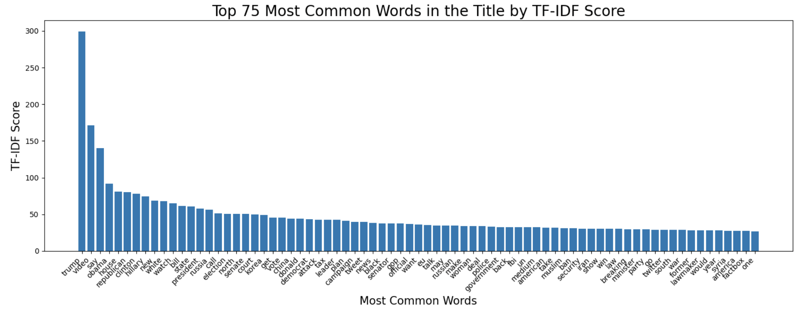

# Introduction
In an ever-changing world, news is a primary way for people to stay informed and make decisions based on current events. Given the influential power of news, it becomes essential to distinguish between truthful and false articles, which is the problem our project aims to address. Using supervised machine learning techniques, we analyzed a dataset of 45,000 news articles. The project focuses on both textual content and metadata features, such as word count, to explore correlations with the truthfulness of the article. 
To achieve this, we employed a Bag of Words model to transform textual data into numerical representations, facilitating effective feature extraction. We then used a Logistic Regression model for initial classification and developed a machine learning pipeline leveraging an XGBoost classifier, enhanced through grid search for hyperparameter tuning. By integrating these techniques, our project aims to build a highly accurate predictive model for identifying fake news. This work has far-reaching implications, potentially aiding efforts to combat misinformation, support fact-checking, and foster a more informed and trustworthy media landscape.

Our decision to tackle this issue stems from the rampant spread of misinformation in the digital era, which often leads to confusion and erodes public trust. By analyzing linguistic nuances in article titles and identifying inherent biases, this project not only addresses a critical real-world problem but also highlights the versatility of machine learning applications.  This combination of understanding language patterns and applying machine learning would not only be solving an important real world problem, but it would also show the diverse ways that AI can be used in our world. The importance of having a good predictive model is that it would allow the public to discern fake news from regular news. This would help not only our democracy but also our society as a whole to be able to trust and be better informed about current events.

## Methods

### Initial Data Exploration & Preprocessing 

Once we got hold of our dataset, the first thing we analyzed was the overall data. Initially, we dealt with an 8117x4 dataset, which while there were many observations, we only had a few features to work with (that being an id column which was negligible, a column for titles, a column for article text, and a label which indicated if the article was real (0) or fake (1)). As such, we decided on doing a deeper dive to see how exactly our text data was like, grabbing more metadata rather than just accepting the text entries as is. Below are our findings/methodology for this initial data exploration:
   - We surprisingly had no null/blank entries
   - We were working with more entries that were fake than real
   - We checked word counts on our text (min: 1.000000, average: 407.745596, median: 368.000000, max: 7304.000000) and title columns (min: 1.000000, average: 12.093754, median: 11.000000, max: 45.000000)

Given we only had a few features to work with, we generated new features of text and title word length by splitting both features by the ' ' character and getting its length. We created a pair-plot to see if these features had any impact on the output label:

We then used a natural language tokenizer (NLTK) to generate word tokens after processing each word to prevent duplicate/meaningless tokens (removing capitalization, plurals, stop words, etc). After creating these tokens, we generated new text and title features that contained these "cleaned tokens" in replacement of these original tokens, all separated by space (called "corpus_text/title"): 

We also engineered a "lexical diversity" feature, which spits out the number of unique tokens in each title and text. This was done by simply creating a set of each list of tokens per observations (which automatically removes duplicates), and taking the length.

After preprocessing, we moved to building our models using our preprocessed dataset. Initially, we tried a more general Bag of Words-style Logistic Regression to see how well we could classify our data. Later on for our subsequent milestone, we tested how our model performed on an XGBoost model. Below are the specifications for our models:

### Model 1 (Bag of Words Logistic Regression)
1. **Preprocessing for Model**  
   - Applied CountVectorizer on the text data on each observation, which counts each word within the dataset vocabulary and creates a vector for the counts of each possible word. This is a bag of words vector.

2. **Model**
   - Logistic Regression model on this bag of words vector
   - Tuned C parameter

3. **Evaluation Metrics**  
   - Used classification metrics such as accuracy, precision, recall, and F1-score to evaluate model performance on training and testing datasets.
   - Computed True Positive, True Negative, False Positive, False Negative values
   - Created Error Complexity Graph to evaluate different values of regularization parameter C

### Model 2 (XGBoost)
1. **Preprocessing for Model**  
   - Cleaned and transformed text data into features like lexical diversity, average word lengths, sentence counts, and more.
   - Dropped unnecessary columns and separated data into features (X) and labels (y).

2. **Model**
   - XGBoost Classifier on feature engineered numerical data
   - Tuned parameters such as `n_estimators`, `learning_rate`, and `max_depth`, `lambda`, and `alpha`
   - Used Graph Search in order to optimize these parameters

3. **Evaluation Metrics**  
   - Used classification metrics such as accuracy, precision, recall, and F1-score to evaluate model performance on training and testing datasets.
   - Computed True Positive, True Negative, False Positive, False Negative values
   - Created Error Complexity Graph to evaluate different values of regularization parameter alpha

### Additional Observation Steps
We also measured our TF-IDF scores on both the title and text entries. This was to mainly help us figure out what specific words/phrases may contribute to classifying our observations. Below are the findings:

Title:

Text:

***

## Results
#### Model 1:
For Model 1 (Bag of Words Logistic Regression), our resulting metrics on the training set were the following: 
   - Precision: 1.00
   - Recall: 1.00
   - F1 Score: 1.00
   - Accuracy: 1.00

For our test set using the same model, our results were:
   - Precision: 0.97
   - Recall: 0.98
   - F1 Score: 0.97
   - Accuracy: 0.97

Error Complexity Graph:

     
#### Model 2:
For Model 2 (XGBoost), our resulting metrics on the training set were the following: 
   - Precision: 0.97 (Class 0); 0.95 (Class 1)
   - Recall: 0.94 (Class 0); 0.98 (Class 1)
   - F1 Score: 0.96 (Class 0); 0.96 (Class 1)
   - Accuracy: 0.96

For our test set using the same model, our results were:
   - Precision: 0.92 (Class 0); 0.89 (Class 1)
   - Recall: 0.87 (Class 0); 0.93 (Class 1)
   - F1 Score: 0.90 (Class 0); 0.91 (Class 1)
   - Accuracy: 0.91

Error Complexity Graph:

# Discussion

# Conclusion
Reflecting on this project, while the results were promising,there are areas requiring further scrutiny to ensure reproducibility on unseen data. Reassessing our first model, a bag-of-words logistic regression, we suspect that data leakage during preprocessing may have influenced predictions, as information from the test data and target variable likely guided the model’s decisions, leading to near-perfect performance. Additionally, applying TF-IDF to both the training and test sets together can cause issues, as the test data influences the term weights, effectively leaking information and inflating performance metrics. Another limitation of TF-IDF, especially in this context, is that if there is vocabulary found in the test set, but not in the training set, this would create a sparse matrix of mostly zeroes, and we need to further investigate how the model is able to generalize on unseen data.

The XGBoost model provided some insight into the importance of different features, however we wish to delve more into this to understand the reasoning behind why these features have the effects that they do. Although, unfortunately, it is likely that this model suffers from the same data leakage problem that affected the previous model, although we believe that in this instance, the data leakage had less of an impact on the model due to the nature of the features used, which were all numerical and less susceptible to being affected by leakage. Regardless, this model needs to be looked into more in order to truly assess the predictive capabilities and the ability to generalize on unseen data.

One area of improvement that we would like to address going forward is the dataset. Ideally, we would curate the dataset ourselves, obtaining a more diverse selection of news topics, from various sources, regions, and possibly even different languages. Even integrating external knowledge bases or fact-checking databases into the pipeline could strengthen the model’s ability to flag misinformation. By doing this, the model will hopefully be more well rounded, able to handle a wide variety of data, including unseen data. 

Another drawback of these models is that they are vulnerable to manipulation. If someone were to know the features which the model runs on, it would be possible to create articles that can get around detection. This highlights a limitation in simpler models such as Bag-of-Words logistic regression and XGBoost classification. To address this in the future, we would likely explore a more complex model, such as LSTMs, that can better capture the complex relationships and sequential dependencies that a simpler model couldn’t. By doing this we hope to make the model more robust and able to generalize with higher confidence. 

Finally, once everything is addressed involving the model, I can see room for enhancing the deployment potential of this model. Packaging the model into an accessible API or web application could enable anyone who wants to check the veracity of a news article. Being able to provide real-time predictions on an article, including confidence scores, would be the ultimate goal of the project.

Overall, while this project represents a step towards combating the spread of misinformation online, it is far from a definitive solution. Language being a dynamic mode of communication, evolving tactics of spreading misinformation, and the sheer complexity of human communication mean there will constantly be new challenges to address. That being said, this project has laid a foundation, and we are excited for the potential future directions we could go in refining and expanding our model. 

