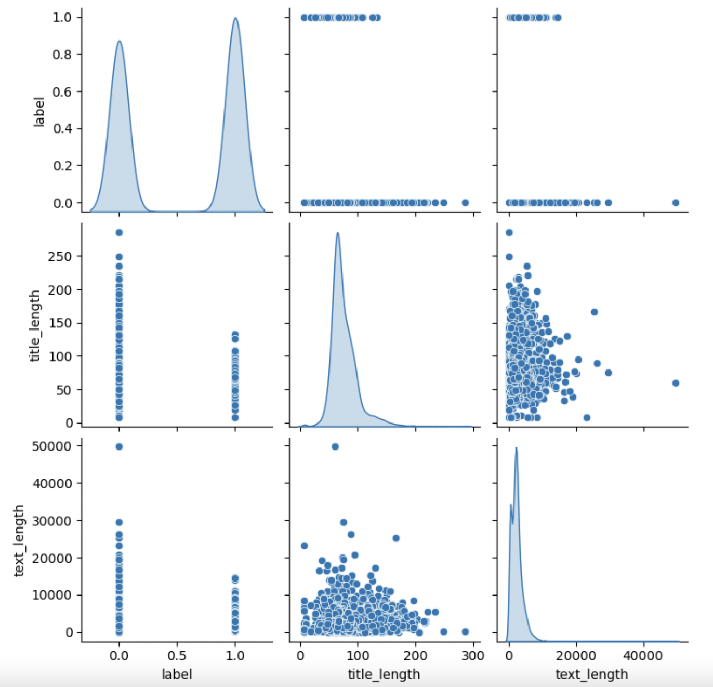
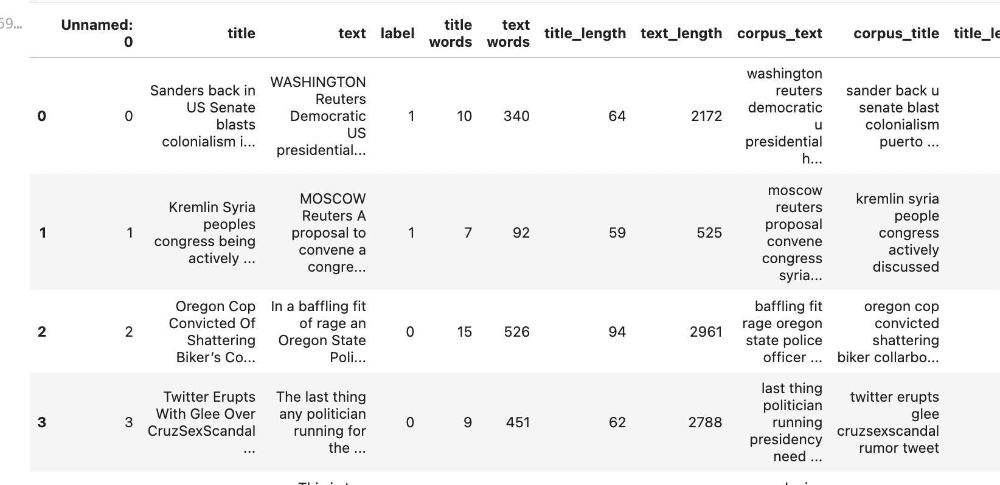
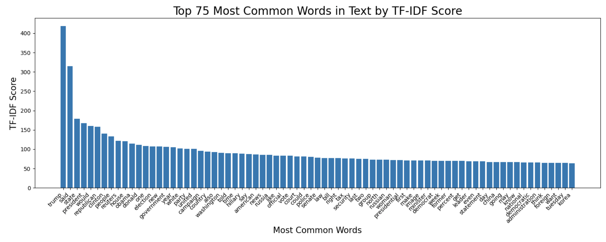

# Introduction
In an ever-changing world, news is a primary way for people to stay informed and make decisions based on current events. Given the influential power of news, it becomes essential to distinguish between truthful and false articles, which is the problem our project aims to address. Using supervised machine learning techniques, we analyzed a dataset of 45,000 news articles. The project focuses on both textual content and metadata features, such as word count, to explore correlations with the truthfulness of the article. 
To achieve this, we employed a Bag of Words model to transform textual data into numerical representations, facilitating effective feature extraction. We then used a Logistic Regression model for initial classification and developed a machine learning pipeline leveraging an XGBoost classifier, enhanced through grid search for hyperparameter tuning. By integrating these techniques, our project aims to build a highly accurate predictive model for identifying fake news. This work has far-reaching implications, potentially aiding efforts to combat misinformation, support fact-checking, and foster a more informed and trustworthy media landscape.

Our decision to tackle this issue stems from the rampant spread of misinformation in the digital era, which often leads to confusion and erodes public trust. By analyzing linguistic nuances in article titles and identifying inherent biases, this project not only addresses a critical real-world problem but also highlights the versatility of machine learning applications.  This combination of understanding language patterns and applying machine learning would not only be solving an important real world problem, but it would also show the diverse ways that AI can be used in our world. The importance of having a good predictive model is that it would allow the public to discern fake news from regular news. This would help not only our democracy but also our society as a whole to be able to trust and be better informed about current events.

## Methods

### Initial Data Exploration & Preprocessing 

Once we got hold of our dataset, the first thing we analyzed was the overall data. Initially, we dealt with an 8117x4 dataset, which while there were many observations, we only had a few features to work with (that being an id column which was negligible, a column for titles, a column for article text, and a label which indicated if the article was real (0) or fake (1)). As such, we decided on doing a deeper dive to see how exactly our text data was like, grabbing more metadata rather than just accepting the text entries as is. Below are our findings/methodology for this initial data exploration:
   - We surprisingly had no null/blank entries
   - We were working with more entries that were fake than real
   - We checked word counts on our text (min: 1.000000, average: 407.745596, median: 368.000000, max: 7304.000000) and title columns (min: 1.000000, average: 12.093754, median: 11.000000, max: 45.000000)

Given we only had a few features to work with, we generated new features of text and title word length by splitting both features by the ' ' character and getting its length. We created a pair-plot to see if these features had any impact on the output label:

We then used a natural language tokenizer (NLTK) to generate word tokens after processing each word to prevent duplicate/meaningless tokens (removing capitalization, plurals, stop words, etc). After creating these tokens, we generated new text and title features that contained these "cleaned tokens" in replacement of these original tokens, all separated by space (called "corpus_text/title"): 

We also engineered a "lexical diversity" feature, which spits out the number of unique tokens in each title and text. This was done by simply creating a set of each list of tokens per observations (which automatically removes duplicates), and taking the length.

After preprocessing, we moved to building our models using our preprocessed dataset. Initially, we tried a more general Bag of Words-style Logistic Regression to see how well we could classify our data. Later on for our subsequent milestone, we tested how our model performed on an XGBoost model. Below are the specifications for our models:

### Model 1 (Bag of Words Logistic Regression)
1. **Preprocessing for Model**  
   - Applied CountVectorizer on the text data on each observation, which counts each word within the dataset vocabulary and creates a vector for the counts of each possible word. This is a bag of words vector.

2. **Model**
   - Logistic Regression model on this bag of words vector
   - Tuned C parameter

3. **Evaluation Metrics**  
   - Used classification metrics such as accuracy, precision, recall, and F1-score to evaluate model performance on training and testing datasets.
   - Computed True Positive, True Negative, False Positive, False Negative values
   - Created Error Complexity Graph to evaluate different values of regularization parameter C

### Model 2 (XGBoost)
1. **Preprocessing for Model**  
   - Cleaned and transformed text data into features like lexical diversity, average word lengths, sentence counts, and more.
   - Dropped unnecessary columns and separated data into features (X) and labels (y).

2. **Model**
   - XGBoost Classifier on feature engineered numerical data
   - Tuned parameters such as `n_estimators`, `learning_rate`, and `max_depth`, `lambda`, and `alpha`
   - Used Graph Search in order to optimize these parameters

3. **Evaluation Metrics**  
   - Used classification metrics such as accuracy, precision, recall, and F1-score to evaluate model performance on training and testing datasets.
   - Computed True Positive, True Negative, False Positive, False Negative values
   - Created Error Complexity Graph to evaluate different values of regularization parameter alpha

### Additional Observation Steps
We also measured our TF-IDF scores on both the title and text entries. This was to mainly help us figure out what specific words/phrases may contribute to classifying our observations. Below are the findings:

Title:

Text:

***

## Results
#### Model 1:
For Model 1 (Bag of Words Logistic Regression), our resulting metrics on the training set were the following: 
   - Precision: 1.00
   - Recall: 1.00
   - F1 Score: 1.00
   - Accuracy: 1.00

For our test set using the same model, our results were:
   - Precision: 0.97
   - Recall: 0.98
   - F1 Score: 0.97
   - Accuracy: 0.97

Error Complexity Graph:

     
#### Model 2:
For Model 2 (XGBoost), our resulting metrics on the training set were the following: 
   - Precision: 0.97 (Class 0); 0.95 (Class 1)
   - Recall: 0.94 (Class 0); 0.98 (Class 1)
   - F1 Score: 0.96 (Class 0); 0.96 (Class 1)
   - Accuracy: 0.96

For our test set using the same model, our results were:
   - Precision: 0.92 (Class 0); 0.89 (Class 1)
   - Recall: 0.87 (Class 0); 0.93 (Class 1)
   - F1 Score: 0.90 (Class 0); 0.91 (Class 1)
   - Accuracy: 0.91

Error Complexity Graph:

# Discussion
#### Initial Data Exploration and Preprocessing
The initial exploration revealed a relatively clean dataset, with no null values and only a slight class imbalance, slightly more false articles than true ones, not large enough of an imbalance to consider using SMOTE or any other oversampling techniques. We further examined the text and title features, including engineered features such as word counts and lexical diversity. These engineered features enriched the dataset, allowing the future models to capture subtle patterns in the articles that were not apparent from the raw text. We hypothesized that longer articles with more diverse vocabulary might indicate higher credibility, whereas overly simplistic or repetitive articles could signal fake news. This was based on the assumption that fake news articles tend to be less nuanced and may exhibit characteristics like shorter length, simpler language, or a more formulaic structure, in order to be easier to digest, and thus more likely to be distributed. 

The tokenization and cleaning processes, including the removal of stop words, punctuation, and non-informative characters, were necessary in making sure that the analysis focused on significant data. These steps were intended to reduce noise and prevent common irrelevant elements from messing up the model’s performance. We expected that these preprocessing techniques would lay a strong foundation for the models; however, a significant flaw in this process was the potential for data leakage. When applying feature engineering and TF-IDF to the entire dataset (both the training and test sets), the test data could have influenced the feature creation. If data leakage did occur due to information from the test set being inadvertently used during model training, this could lead to inflated performance metrics. This issue is particularly concerning, as it means the model might not generalize well to actually unseen data, we have to investigate this further. We cannot quantify the extent of data leakage but could have contributed to the high accuracy observed in subsequent models, especially since TF-IDF is heavily influenced by the term frequencies across the dataset. For future iterations, we should fit these transformations exclusively on the training set and then applying them to the test set, ensuring that no information from the test set is used in model development.

#### Model 1 Bag of Words Logistic Regression
Our initial logistic regression model provided an intuitive baseline. It is more simple than the decision tree model we later used, and allowed us to assess the effectiveness of the bag-of-words representation, where text is transformed into a vector of word counts. Using the corpus text and titles created by preprocessing steps, we trained the logisitic regression model, and despite the straightforward approach, it achieved impressive results with a test accuracy of 97%, however we were skeptical of the near perfect results, especially on our first try before any hyperparameter tuning, causing us to believe that the model may just be memorizing the answers rather than generalizing. Regardless, we wanted to optimize the model, so we created a error analysis graph to find the ideal value for C. 

After some investigation, we were able to find a possible case of data leakage in the preprocessing stage as talked about above. As a result, data from the test set could have unintentionaly influenced the feature creation process, including tokenization, which would be a valid explanation for the inflated accuracy reports. We still believe there is validity and potential for the model overall, just in this case, we are going to have to address these issues and check to see if the model is actually able to generalize. 

#### Model 2 XGBoost Classifier
The XGBoost model leveraged the enriched feature set, containing engineered numerical features such as length, lexical diversity and average word lengths. By moving beyond simple word counts and excluding text-based features entirely, we wanted to avoid the issue of memorization that we suspected occurred with the previous model. Our goal was to ensure that the model learned more generalized patterns from the data, rather than simply memorizing the test set, which could lead to overfitting, so none of the original text or titles were passed into the model.

When we ran the XGBoost model, we observed relatively high accuracy scores: 91% on the testing set and 96% on the training set. In attempt to further optimize, we used grid search to find the optimal combination for hyperparameters, which boosted results further. We believed these results were promising, that the slight decrease in accuracy from the previous model reflected the new model’s ability to generalize rather than memorize, which made the results more believable compared to the near-perfect performance of the logistic regression model. 

However, despite the more realistic performance of the XGBoost model, we cannot be completely confident in these results without further investigation. There is still a possibility that data leakage occurred and affected this model as well, although we believe that the solely numerical, engineered features—based on text and title characteristics—would have reduced the likelihood of this issue. Nevertheless, to ensure that the accuracy scores are more representative of the model's generalization ability, additional checks for potential data leakage and further analysis would be necessary. Given these considerations, we feel more confident in the results of the XGBoost model than in the earlier logistic regression model, but we still acknowledge the need for a more thorough evaluation along with a more thorough preprocessing pipeline.

# Conclusion
Looking back on this project, while the results were promising, there are areas requiring further scrutiny to ensure reproducibility and generalizability. The main issue highlighted in the project is the identification of potential data leakages in the preprocessing stages, especially when using techniques like TF-IDF. Future versions will need to ensure robust preprocessing pipelines, alongside diverse and representative datasets. 

One area of improvement that we would like to address going forward is our dataset. Ideally, we would curate the dataset ourselves, obtaining a greater variety of news topics, from various sources, regions, and possibly even different languages. By doing this, the model will hopefully be more well rounded, able to handle a wide variety of data, including unseen data. 

Another drawback of these models is that they are vulnerable to being bypassed. If someone were to know the features which the model runs on, it would be possible to create articles that can get around detection. This highlights a limitation in simpler models such as Bag-of-Words logistic regression and XGBoost classification. To address this in the future, we would likely explore a more complex model, such as LSTMs, that can better capture the complex relationships and sequential dependencies that a simpler model couldn’t. By doing this we hope to make the model more robust and able to generalize with higher confidence. 

Finally, once everything is addressed involving the model, I can see room for enhancing the deployment potential of this model. Implementing the model in an accessible API, website, or even browser extension could enable anyone who wants to check the veracity of a news article. Being able to provide real-time predictions on an article, including confidence scores, would be the ultimate goal of the project.

Overall, we think that this project is a step towards combating the spread of misinformation online, it is far from a definitive solution. Language being a constantly changing mode of communication, evolving tactics of spreading misinformation, and the sheer complexity of human communication mean there will constantly be new challenges to address. That being said, this project has laid a foundation, and we are excited for the potential future directions we could go in refining and expanding our model. 

